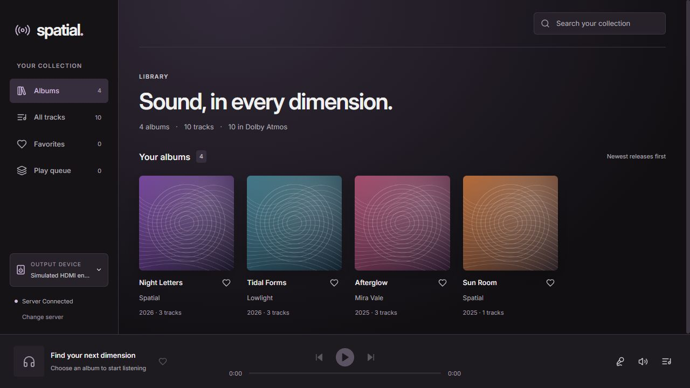
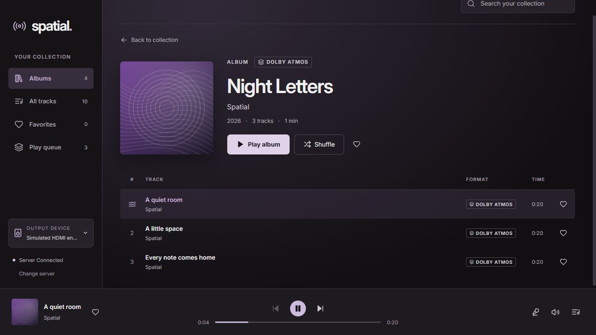
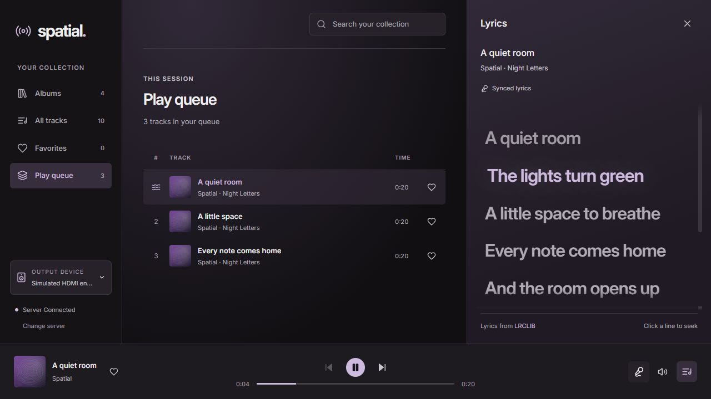

# Spatial

### Dolby Atmos music streaming, with a player built around the music.

Spatial connects a music library on a server to a native desktop player. Browse albums, follow synced lyrics, and send the original Dolby audio bitstream over HDMI to an Atmos-capable receiver.

The server discovers albums from file metadata and keeps connected clients up to date. Place music in the configured media directory; Spatial handles the catalog, artwork and streaming.



**[Get started](#get-started)** · **[Screenshots](#a-closer-look)** · **[Playback](#playback)**

## What you can do

- **Stream original Dolby audio.** E-AC-3 and TrueHD passthrough through the Windows HDMI output, with source files served without transcoding.
- **Browse a live library.** Albums, artists, artwork and track order come from embedded tags. Filesystem changes reach connected clients automatically.
- **Make it yours.** Save favorite albums and tracks locally on each device, and search the collection as you browse.
- **Follow the words.** Synced lyrics appear in a resizable side panel. Click a line to seek, or keep browsing while the song continues.
- **Keep listening.** Build a playback queue, move between tracks, and reopen the app with the server connection remembered securely.
- **See the album in the interface.** Artwork sets the palette, with smooth color changes, transitions and support for reduced motion.

## A closer look

### Albums and tracks

Artwork, release information and the track list stay together in the album view.



### Queue and synced lyrics

The queue lives in the main view. Lyrics sit beside it, with adjustable width and a highlight that follows playback.



*Screenshots show the current interface with original demo artwork, fictional releases and simulated playback.*

## Get started

Spatial has two parts: a server that reads the music files and a desktop app that plays them. They can run on separate machines or on the same computer.

| Component | Current requirements |
| --- | --- |
| Server | Rust service with FFmpeg/FFprobe; native Linux setup scripts are provided. MediaInfo improves Atmos metadata detection. |
| Desktop | Windows x64 with WebView2 and an HDMI audio endpoint connected to an Atmos-capable receiver. |

1. **Start the server.** Follow the [server setup guide](docs/server.md), choose a media directory, and create an access token. Configuration, the catalog and artwork cache can stay in the project directory.
2. **Build the desktop app.** Follow the [Windows build guide](docs/development.md#build-the-desktop-app). The installer bundles the playback engine.
3. **Connect and play.** Enter the server's reachable HTTP or HTTPS address and its access token. Choose the receiver's HDMI endpoint in Audio output, then play an album.

The app remembers a successful connection in Windows Credential Manager and reconnects on launch. The server address is configurable; use the address that reaches your deployment.

Spatial runs natively. Docker is not required.

## Playback

```text
Music files → Spatial server → Windows desktop → HDMI bitstream → AVR
```

The server streams original file bytes. The native player demuxes the audio and requests compressed Dolby output through WASAPI exclusive mode, preserving the encoded Atmos information for the receiver to decode.

This is an early preview. Playback currently supports the compressed E-AC-3 and TrueHD path. Other formats can appear in the library, but AAC, FLAC and MP3 playback is not implemented. Volume is controlled on the receiver; software volume, EQ, normalization, crossfade and seamless gapless playback are unavailable. Dolby MAT is outside the current playback path.

## Library and privacy

Albums are grouped by metadata rather than folder names. Consistent album, album-artist, date and release tags produce the best results. Embedded artwork is preferred, with adjacent cover images as a fallback.

Favorites, panel width and output preferences stay on the client. Lyrics use [LRCLIB](https://lrclib.net/), with no account or API key: opening the panel may send the track's title, artist, album and duration to the provider. Audio files and server credentials are not sent. Cached lyrics remain available offline; coverage depends on the recording.

## For contributors

The server uses **Rust, Axum and SQLite**. The desktop uses **Tauri, React, TypeScript and Motion**, with a native mpv playback process.

See [development and testing](docs/development.md) for the repository layout, local preview, build commands and passthrough checks. Persistent playlists, library editing, multi-user accounts and automatic server discovery are planned work.

## License

Spatial's code is released under the [MIT License](LICENSE). The desktop includes [Inter](https://rsms.me/inter/) under its [SIL Open Font License](apps/desktop/public/fonts/OFL.txt). Bundled mpv and its dependencies retain their own licenses;
