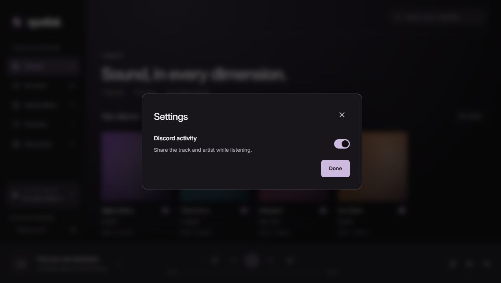

# Discord activity

Open **Settings** from the gear beside **Change server**, then turn on **Discord activity**. The choice is saved on this desktop. Sharing starts disabled.

While music plays, Discord shows **Listening to Spatial**, the track, artist, album and a progress bar. Seeking updates the timeline. Pausing, stopping, ending playback, changing servers, installing an update or closing Spatial clears the activity. The Discord desktop client must be running and its activity sharing settings must allow it.

Spatial connects through Discord's local Windows IPC. Discord availability never blocks the player: the separate worker bounds connection and command waits, retries when Discord becomes available, and coalesces normal playback progress. It shares track metadata, without sending a server address, media URL, access token or local file path. No music server changes are needed.

## Maintainer setup

The public Discord Application ID and artwork key are in [config/discord.json](../config/discord.json). The app should be named **Spatial** in the [Discord Developer Portal](https://discord.com/developers/applications). No bot token, client secret or OAuth login is required for Rich Presence.

Upload [the Spatial icon](../apps/desktop/src-tauri/icons/icon.png) as the application's icon and as a Rich Presence art asset with the key **spatial**. The app displays this artwork with the album name as its tooltip. Private server cover art is not uploaded to Discord.

Rebuilding after changing the public configuration includes it in desktop clients. Fork maintainers can use their own application ID and artwork key. Credentials never belong in this file.

## Verification

Native tests exercise the listening payload, millisecond timestamps, seek detection, clearing conditions, Unicode metadata limits, framed IPC handshake, ping/pong, activity acknowledgements, clear requests and unresponsive peers. The fake transport never writes a Discord profile. Interface fixtures exercise the saved toggle without connecting to Discord.

For a live check, enable sharing with the Discord desktop client open, play a track, seek, pause and resume. Confirm activity appears, its timeline moves after a seek, and it clears on pause and app exit. Close and reopen Discord while playing to check reconnection.
