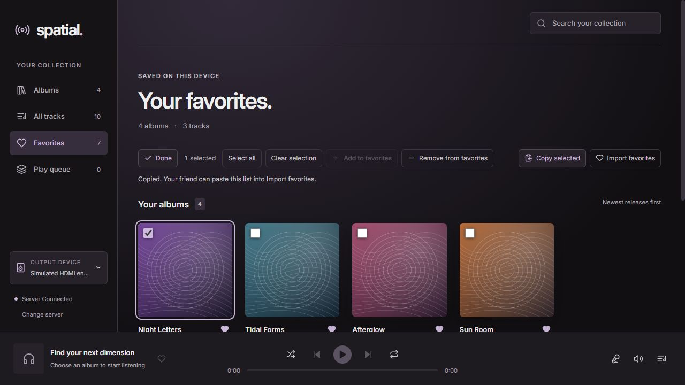

# Favorites

Favorites stay on the device and are stored separately for each server connection. Albums and individual tracks can be saved independently.

## Share a list

1. Open **Favorites** and choose **Copy favorites**.
2. Send the copied text to another Spatial listener.
3. On their client, open **Favorites → Import favorites**, paste the text and choose **Add matching favorites**.

Import merges matches into the existing favorites. It does not replace them. The result reports added items, items absent from the library, and ambiguous matches that were skipped. Importing the same list again does not create duplicates.

The list contains album and track metadata, including titles, artists, release dates, track numbers and durations. It excludes audio files, server addresses, access tokens, paths, artwork and server-specific IDs. Your friend needs the matching music in their own server's library; sharing a favorites list does not transfer music or grant access to your server.

Matching ignores letter case and extra whitespace. Release year, duration and track numbering help distinguish recordings. Different tags or editions may not match; ambiguous entries are skipped rather than guessed.

## Manage several items

Choose **Select** in Albums, All tracks, an album, Favorites or Play queue. Use the checkboxes or item titles to select items, then choose **Add to favorites** or **Remove from favorites**. **Select all** includes the currently visible search results. Changing the search or collection clears the selection.

In Favorites, selecting items changes **Copy favorites** to **Copy selected**, so you can share a subset. **Done** returns to normal browsing and playback.

*Preview uses fictional releases and original demo artwork.*

## Clipboard fallback

The Windows app writes through Tauri's native clipboard plugin. Import reads only the text you paste into the form. If copying is unavailable, the app displays the list for manual copying.

The portable format is JSON with `format: "spatial-favorites"` and `version: 1`. Imports are limited to 10,000 entries and two million characters. Unsupported versions and malformed lists are rejected without changing favorites.
